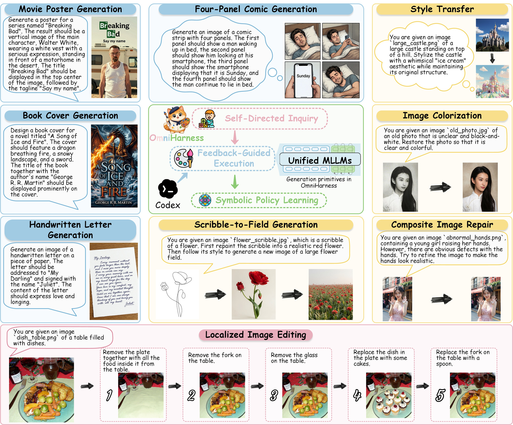
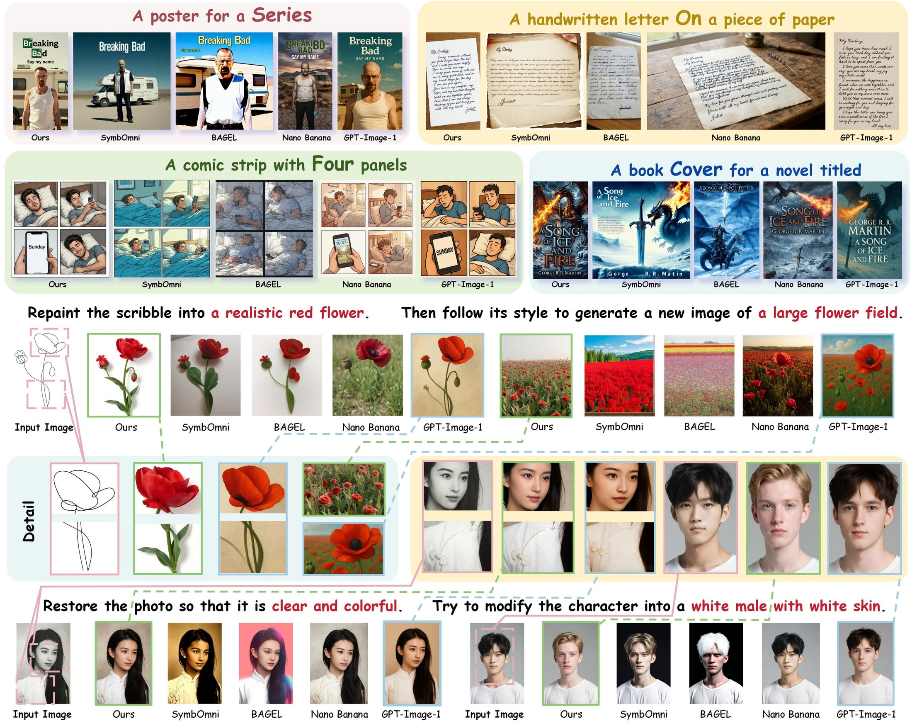
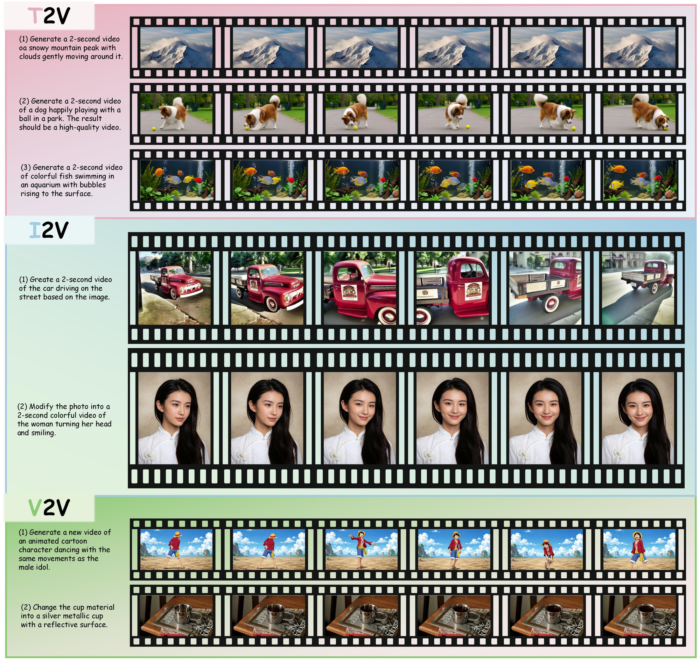
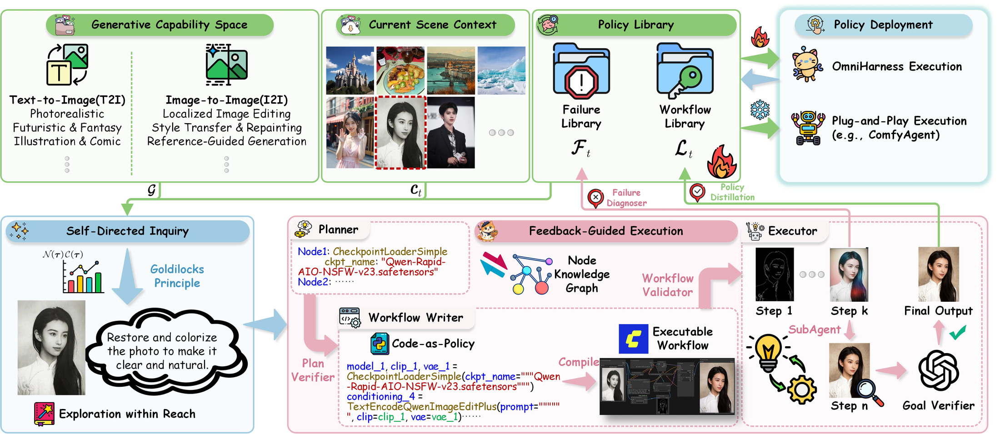
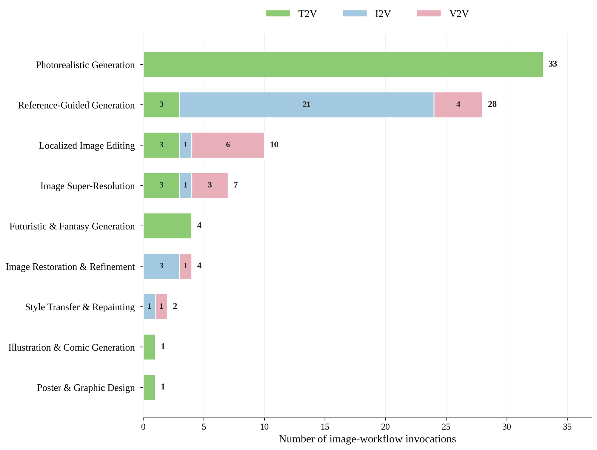

<div align="center">

# OmniHarness

### Harnessing Generalizable Visual Generation<br>via Symbolic Policy Learning

**Turn one successful execution into a reusable method for a family of tasks.**

Xu Xu<sup>1</sup> · Jinxiu Liu<sup>2</sup> · Zhangbo Qiao<sup>1</sup> · Jiaxing Lu<sup>1</sup><br>
Xiangyu Zhang<sup>1</sup> · Yubin Gu<sup>3</sup> · Fangwei Ning<sup>1</sup> · Yan Shi<sup>1</sup>

<sup>1</sup>Beihang University &nbsp; <sup>2</sup>The Chinese University of Hong Kong<br>
<sup>3</sup>National University of Singapore

[](https://arxiv.org/abs/2609.16057)
[](https://omniharness.github.io/)
[](#quick-start)
[](LICENSE)

[Highlights](#highlights) · [Gallery](#gallery) · [Method](#method) · [Quick Start](#quick-start) · [Results](#results) · [Citation](#citation)

</div>

OmniHarness is a visual generation harness that **improves its symbolic policy library while keeping model parameters fixed**. It practices before downstream tasks arrive, checks intermediate results during execution, and turns verified experience into reusable procedures. This repository connects a Codex reasoning backend with ComfyUI for workflow construction and execution.

<p align="center">
  <a href="docs/assets/omniharness-overview.jpg"></a>
  <br><sub>From creative generation to multi-step editing: practice, verify, and reuse. Click the figure for the full-resolution overview.</sub>
</p>

## Highlights

- **Learn procedures for task families.** Abstract verified executions into symbolic policies with applicability conditions and task-specific inputs that can be rebound.
- **Check as you go.** Verify intermediate artifacts and repair failed steps while preserving verified work.
- **Practice within reach.** Propose tasks near the current competence frontier before downstream objectives are specified.
- **Carry experience forward.** Reuse frozen policy snapshots across visual agents and compose image policies with video-specific components.

| ComfyBench Total Resolve | ComfyBench Creative Resolve | Evaluation scope |
| :---: | :---: | :---: |
| **92.5%** with **100% Pass** | **95.0%** · **+27.5 points** over the strongest reported baseline | **6 benchmarks · 3 MLLM backbones · 3 agent frameworks** |

*Paper-reported results. The 92.5% Total Resolve result uses Codex GPT-4o + OmniHarness. Creative gains are percentage points; see [Results](#results) for configurations and transfer experiments.*

## Gallery

Posters, letters, comics, book covers, and multi-step transformations put both visual quality and instruction following to the test.

<details>
<summary><strong>View Complex and Creative ComfyBench comparisons</strong></summary>

<p align="center">
  <a href="assets/readme/visual-examples.jpg"></a>
</p>

Qualitative examples reported in the paper, with the original method labels and task groupings preserved.

</details>

<details>
<summary><strong>View video tasks using policies learned from image-only inquiry</strong></summary>

<p align="center">
  <a href="assets/readme/video-examples.jpg"></a>
</p>

Sampled video frames from T2V, I2V, and V2V tasks. A frozen policy snapshot learned through image-only inquiry supplies reusable image procedures, which are composed with video-specific components.

</details>

## Method

**Self-directed inquiry → feedback-guided execution → symbolic policy learning.** Experience accumulates in an external policy library; model parameters remain fixed.

<p align="center">
  <a href="docs/assets/runtime-architecture.jpg"></a>
</p>

| Mechanism | What happens | What is retained |
| --- | --- | --- |
| **Self-directed inquiry** | Propose practice tasks and select challenges balancing capability novelty with estimated learnability. | Experience acquired before downstream tasks are known. |
| **Feedback-guided execution** | Retrieve, instantiate, adapt, or compose policies; verify intermediate outputs and recover locally. | Verified steps and evidence for refinement. |
| **Symbolic policy learning** | Abstract executions into reusable workflow templates and record failure evidence and corrective strategies. | A Workflow Library and a Failure Library for future tasks. |

The runtime compiles a restricted Python-like **Code-as-Policy** program into a ComfyUI graph. Generated Python is **not executed directly**. Prompts, source media, seeds, and output names become binding roles; graph structure, model choices, and other execution parameters are retained. Compilation and validation reject unbound placeholders.

<details>
<summary><strong>Inside the policy library and inquiry objective</strong></summary>

The policy state is $\mathcal{S}_t=(\mathcal{L}_t,\mathcal{F}_t)$. The Workflow Library $\mathcal{L}_t$ stores templates, preconditions, expected effects, dependencies, and usage statistics. The Failure Library $\mathcal{F}_t$ stores failure evidence and corrective strategies. When applicable policies are insufficient, the agent can build workflows using the ComfyUI node knowledge graph $\mathcal{K}$.

Given the generative capability space $\mathcal{G}$, scene context $c_t$, and current library, **Exploration within Reach** selects a practice task from the candidate set $\mathcal{T}_t$:

$$
\tau_t = \underset{\tau \in \mathcal{T}_t}{\arg\max}\; \mathcal{N}(\tau)\,\mathcal{C}(\tau),
\qquad
\mathcal{C}(\tau)=4\bar{r}_t(\tau)\bigl(1-\bar{r}_t(\tau)\bigr).
$$

Novelty $\mathcal{N}$ favors underexplored context-capability pairs. The frontier score $\mathcal{C}$ favors intermediate estimated competence. Task competence follows the weakest required capability; each capability uses the highest lower 95% Wilson bound among applicable, non-suspended workflows.

Self-directed inquiry is motivated by Wang Yangming's interpretation of *the investigation of things and the extension of knowledge*. See the [paper](https://arxiv.org/abs/2609.16057) for the full formulation.

The supplied reference records are in [`resources/symbolic_policy`](resources/symbolic_policy), including `workflow_metadata.json` and `failure_metadata.json`. Invocation counts attribute submitted attempts to plan-selected policies; success counts use task-level verification, not independent component success measurements.

</details>

## Quick Start

### 1. Prepare the environment

You need **CPython 3.10.x**, Codex access to a **Responses-compatible reasoning endpoint**, and a running **ComfyUI** instance with the required custom nodes and generation models. Installing Python dependencies does not install these models or nodes.

```bash
git clone https://github.com/OmniHarness/OmniHarness.git
cd OmniHarness
python -m venv .venv
source .venv/bin/activate
python -m pip install -r requirements.txt
cp config.example.yaml config.yaml
```

On Windows PowerShell, use `.venv\Scripts\Activate.ps1` to activate and `Copy-Item config.example.yaml config.yaml` to create the configuration. `requirements.txt` covers the runtime and legacy evaluators; GenEval2 needs a [separate evaluation environment](BENCHMARKS.md#evaluation-environments).

### 2. Connect the reasoning model and ComfyUI

Edit `config.yaml`:

```yaml
codex:
  model: gpt-4o
  provider: omniharness_gpt4o
  base_url: https://YOUR_PROVIDER.example/v1
  api_key_env: OMNIHARNESS_API_KEY
  reasoning_effort: null

runtime:
  comfyui_url: http://127.0.0.1:8188
```

Use your provider's API root, such as `/v1`, rather than its `/responses` route. Set the credential in the named environment variable:

```bash
export OMNIHARNESS_API_KEY="YOUR_API_KEY"
```

Windows PowerShell: `$env:OMNIHARNESS_API_KEY = "YOUR_API_KEY"`. Keep credentials and `config.yaml` outside version control. `--codex-model` selects the model used by the Codex backend.

### 3. Check the setup and start practicing

Run from the repository root. For the default inquiry setup, first prepare the source images referenced by [`resources/source_image_pool_comfybench/source_image_metadata.json`](resources/source_image_pool_comfybench/source_image_metadata.json). **The metadata is included; the image files are not.** Preflight checks the listed images and their recorded sizes, along with dependencies, credentials, and the ComfyUI connection:

```bash
python scripts/run_omniharness.py --config config.yaml --preflight-only inquiry
```

Start self-directed inquiry:

```bash
python scripts/run_omniharness.py --config config.yaml inquiry \
  --iterations 50 \
  --candidate-count 10 \
  --memory-mode online \
  --max-retries 4
```

The default policy library is `runs/policy_library`. **A new path starts empty; an existing state is preserved.** Use `--symbolic-policy` with a separate path for an independent run. Four retries permit up to five attempts, including the initial attempt; `--max-attempts` instead specifies the total count.

<details>
<summary><strong>Source images and inquiry scope</strong></summary>

- The default source pool is `resources/source_image_pool_comfybench`. Use `--source-image-pool resources/source_image_pool_gpt` for the independently generated image pool. Both pools include metadata in Git; their `images/` contents must be prepared locally before I2I inquiry.
- Inquiry supports T2I and I2I; downstream contracts can additionally specify video tasks.
- For GenEval, GenEval2, and WISE, use `inquiry --modality T2I` with a new library. This restricts inquiry to a general T2I capability space without loading source images or benchmark evaluation tasks.
- For I2I inquiry, downstream instructions, target outputs, reference workflows, annotations, and evaluation labels are withheld.

</details>

### 4. Export experience for reuse

Export immediately after inquiry and before downstream updates to obtain the frozen inquiry snapshot:

```bash
python scripts/run_omniharness.py --config config.yaml snapshot \
  --destination snapshots/inquiry50
```

Reuse it with `--symbolic-policy snapshots/inquiry50 --memory-mode frozen`. If inquiry used a custom `--symbolic-policy` source path, pass that same source path when exporting. The destination must be new and outside the source library. To consolidate the current state, run `python scripts/run_omniharness.py --config config.yaml consolidate`.

> **For controlled evaluation:** the bundled `resources/symbolic_policy` is a reference library with 43 workflow records and historical failure records, including downstream task traces. It is **not an isolated inquiry snapshot**. Start from a new empty library, run inquiry, and export before downstream updates.

<details>
<summary><strong>What a frozen snapshot contains</strong></summary>

The snapshot $\mathcal{K}_{\mathrm{inquiry}}$ includes parameterized workflow policies, failure evidence and corrective strategies, reliability statistics, a frozen marker, and a checksum manifest. Task history and proposal bookkeeping are omitted. Frozen execution still supports retrieval, binding, adaptation, composition, verification, and recovery; it disables persistent library updates.

</details>

### 5. Execute a downstream task

Pass a task contract JSON following the [`TaskContract` schema](src/omniharness/self_directed_inquiry.py), such as a contract saved during inquiry:

```bash
python scripts/run_omniharness.py --config config.yaml execute \
  --task-contract path/to/task_contract.json \
  --memory-mode online
```

| Mode | Task-specific adaptation and recovery | Persistent library updates |
| --- | :---: | :---: |
| `online` | Yes | Yes |
| `frozen` | Yes | No |

`--dry-run` previews proposal, planning, compilation, and validation without submitting workflows to ComfyUI. It **still makes reasoning-model calls**.

## Results

All numbers below are **reported in the paper**, not newly reproduced by this checkout. Benchmark scores use their original scales; they should not be compared across rows.

### Six visual generation benchmarks

| Benchmark | Reported result |
| --- | --- |
| **ComfyBench** | **100.0% Pass · 92.5% Total Resolve** with Codex GPT-4o + OmniHarness |
| **GenEval** | **0.997** overall |
| **GenEval2** | **89.78** overall; Object / Attribute / Count / Position / Verb: **95.0 / 94.0 / 94.0 / 76.9 / 89.0** |
| **Reason-Edit** | Understanding: **23.894 PSNR · 0.856 SSIM · 0.053 LPIPS · 24.554 CLIP**; Reasoning: **0.796 SSIM · 21.318 CLIP** |
| **WISE** | **0.86** WiScore |
| **KRIS-Bench** | **77.33** overall |

### One frozen policy snapshot, three host agents

The same frozen inquiry snapshot improves the original host agents **without model fine-tuning** (paper Table 16). Policies are adapted to each host's native knowledge interface while preserving its original control flow.

| Host agent | Original Total Resolve | With inquiry policies | Gain |
| --- | ---: | ---: | ---: |
| ComfyAgent | 32.5% | **57.0%** | **+24.5 points** |
| ComfyMind | 83.0% | **88.0%** | **+5.0 points** |
| SymbOmni | 86.0% | **89.0%** | **+3.0 points** |

### Image-only inquiry transfers to video tasks

GPT-4o + OmniHarness uses a frozen snapshot learned **without video tasks during inquiry**. On the ComfyBench video subset, it reports **100% Pass** in every category (paper Table 17):

| Metric | Text to video | Image to video | Video to video | Total |
| --- | ---: | ---: | ---: | ---: |
| Resolve | **84.2%** | **92.0%** | **80.0%** | **85.9%** |

<details>
<summary><strong>Which image policies are reused in video workflows?</strong></summary>

<p align="center">
  <a href="assets/readme/image-policy-reuse.png"></a>
</p>

The figure reports **workflow invocation counts**, not independent task counts or success rates. Image policies provide reusable components for video workflows; the chart is not a causal attribution of performance gains.

</details>

## Reproduce the Benchmarks

See **[BENCHMARKS.md](BENCHMARKS.md)** for official data, local paths, evaluator dependencies, and metric definitions. Start downstream evaluation from the intended post-inquiry policy library. Task order affects online evolution: independently evolving shards do not reproduce the same state trajectory as a sequential run.

<details>
<summary><strong>Run and evaluation commands for all six benchmarks</strong></summary>

| Benchmark | Run | Evaluate |
| --- | --- | --- |
| ComfyBench | `python scripts/run_comfybench.py --memory-mode online` | `python scripts/evaluate_comfybench.py` |
| GenEval | `python scripts/run_geneval.py --memory-mode online` | `python scripts/evaluate_geneval.py` |
| GenEval2 | `python scripts/run_geneval2.py --memory-mode online` | `python scripts/evaluate_geneval2.py` |
| Reason-Edit | `python scripts/run_reasonedit.py --memory-mode online` | `python scripts/evaluate_reasonedit.py` |
| WISE | `python scripts/run_wise.py --variant original --memory-mode online` | `python scripts/evaluate_wise.py --variant original` |
| KRIS-Bench | `python scripts/run_kris_bench.py --memory-mode online` | `python scripts/evaluate_kris_bench.py` |

Obtain official benchmark data under the local `bench data/` paths documented in [BENCHMARKS.md](BENCHMARKS.md). Generated runs use `runs/`; benchmark media and evaluation summaries use `results/`.

The ComfyBench evaluator reports output coverage and Resolve. **Output coverage is not the execution Pass rate.** If `per_sample.json` already exists, choose a new `--output-dir` or use `--overwrite` to recompute. Reason-Edit masks are evaluation-only inputs; keep benchmark annotations outside the generation workspace.

</details>

## Repository Layout

```text
assets/readme/                       # Web-sized paper figures for this README
resources/
  comfyui_node_reference/            # ComfyUI node documentation
  source_image_pool_comfybench/      # ComfyBench metadata; images prepared locally
  source_image_pool_gpt/             # Generated-pool metadata; images prepared locally
  symbolic_policy/                  # Reference workflow and failure records
src/omniharness/
  self_directed_inquiry.py           # Practice-task proposal and selection
  omniharness_runtime.py             # Execution, verification, and recovery
  symbolic_policy.py                 # Policy library management
scripts/                            # Runtime, benchmark, and evaluation commands
docs/                               # Project page
config.example.yaml                 # Configuration template
BENCHMARKS.md                       # Benchmark setup and evaluation guide
CITATION.bib                        # Paper citation
```

## Citation

If OmniHarness is useful for your research, please cite our [paper](https://arxiv.org/abs/2609.16057). A standalone BibTeX file is available at [`CITATION.bib`](CITATION.bib).

```bibtex
@misc{xu2026omniharnessharnessinggeneralizablevisual,
  title={OmniHarness: Harnessing Generalizable Visual Generation via Symbolic Policy Learning},
  author={Xu Xu and Jinxiu Liu and Zhangbo Qiao and Jiaxing Lu and Xiangyu Zhang and Yubin Gu and Fangwei Ning and Yan Shi},
  year={2026},
  eprint={2609.16057},
  archivePrefix={arXiv},
  primaryClass={cs.LG},
  url={https://arxiv.org/abs/2609.16057},
}
```

## License

Source code is released under the [Apache License 2.0](LICENSE). Benchmark data, models, node packages, and other third-party assets retain their own terms. See [THIRD_PARTY_ASSETS.md](THIRD_PARTY_ASSETS.md) before redistribution.
